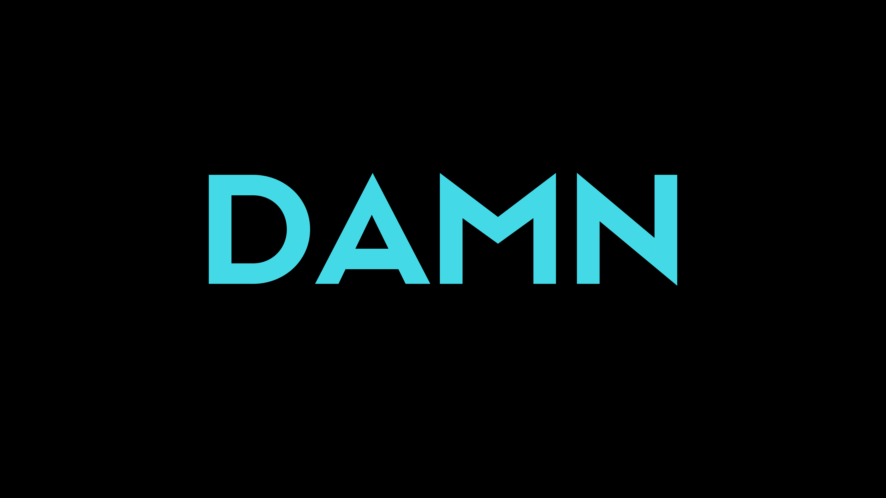

# DAMN - Don't ask me now! [Go-ogle](https://google.com)

## Read Carefully!
I'm incredibly disturbed. In every stream I watch, every article I read, every forum I follow, every question I see, people are constantly asking the same things, the same topics are constantly being discussed. Because the same things are asked.

**Questions-Answers Cycle Paradox**
* What is this?
* How can I start?
* Where can I learn?
* How can I install?
* Where can I find it?
* Where should I start?
* Introduction to ……!
shit
shi
sh
s
.

This is supply-demand balance. Whatever you want, it is produced. Something has to change now. Because it's so simple!

---

## We get dirty!
Universally, I think we get more dirty every day. Just as we care about personal cleaning, environmental pollution or global warming, we should also care about information pollution. It is getting harder every day to find quality, authentic, correct and useful content.

When researching a topic, I keep my obsessive disorder and anxiety when browsing forums or any information sharing application.

### BECAUSE!
Every day, every day and every day… We always ask the same questions. We ask questions that have been answered before. We forgot to do research or “Have it been answered before?". So, We read the same answers thousands of times.

Don't ask like this question anyone at anywhere! “Hey guys! What is ‘Eiffel Tower?'” **Just GO-OGLE it.**

If you dont find anything about “Eiffel Tower” (really?), ASK!

---

## We get suffocate!
After thousands of years of settled life, we polluted the world, the world goes towards an uninhabitable state, we closed our homes and started living on the Internet. The order of contamination is on the Internet now. And, We can't reach the speed of living on the internet.

Millions of people produce something every second and share on the internet. There is definitely an answer about the subject you are going to ask. If you can't find the answer to your question, you're lucky. You can ask as much as you want anywhere.

Just look anywhere, read carefully, do research. ~~**DON'T ASK ME NOW!**~~ The question you want to ask is polluting the Internet like a garbage.

--- 

## We don't exactly understand…
Think you're in god mode in a game you're playing. It has a search box and you have to answer whatever you ask. Brings you everything you want in seconds.

* You have the power to **do** everything.
* You have the power to **find** everything.
* You have the power to **read** everything.
* You have the power to **understand** everything.

### BUT!
You dont use this power! You choose to steal people's time. You choose the easy one like a coward!

Your mind is like a dynamic machine. Thousands of neurons are waiting to generate new neural networks. But, you kill them one by one by not using them!
---

# EVERYONE!
Until this time, Let's do the best for the people. Let's create a new awareness. People are losing their research skills. They lose their feelings of curiosity and creativity decreases. If someone asks you a question, tell him/her: **DAMN - Don't Ask Me Now! Go-ogle**

## - [x] Stop The Pollution!
## - [x] Save the Internet!
## - [x] DAMN!
